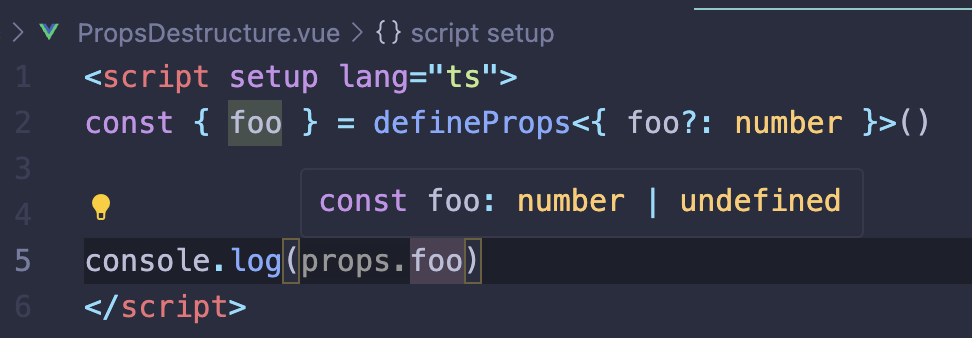
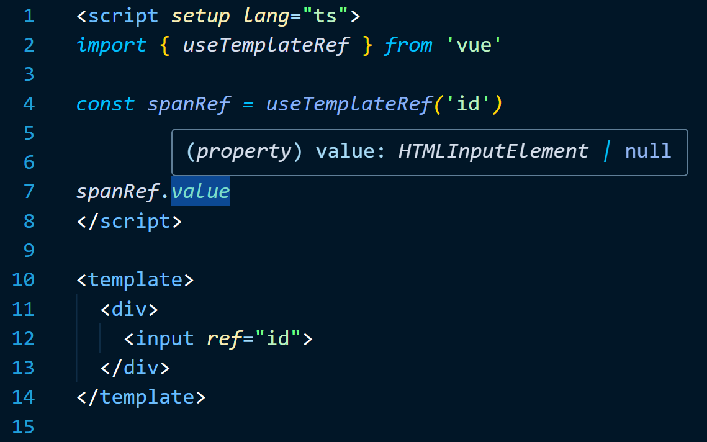

Today we are excited to announce the release of Vue 3.5 "Tengen Toppa Gurren Lagann"!

This minor release contains no breaking changes and includes both internal improvements and useful new features. We will cover some highlights in this blog post - for a full list of changes and new features, please consult [the full changelog on GitHub](https://github.com/vuejs/core/blob/main/CHANGELOG.md).

---

[[TOC]]

## Reactivity System Optimizations

In 3.5, Vue's reactivity system has undergone another major refactor that achieves better performance and significantly improved memory usage (**-56%**) with no behavior changes. The refactor also resolves stale computed values and memory issues caused by hanging computeds during SSR.

In addition, 3.5 also optimizes reactivity tracking for large, deeply reactive arrays, making such operations up to 10x faster in some cases.

**Details: [PR#10397](https://github.com/vuejs/core/pull/10397), [PR#9511](https://github.com/vuejs/core/pull/9511)**

## Reactive Props Destructure

**Reactive Props Destructure** has been stabilized in 3.5. With the feature now enabled by default, variables destructured from a `defineProps` call in `<script setup>` are now reactive. Notably, this feature significantly simplifies declaring props with default values by leveraging JavaScript's native default value syntax:

**Before**

```ts
const props = withDefaults(
  defineProps<{
    count?: number
    msg?: string
  }>(),
  {
    count: 0,
    msg: 'hello'
  }
)
```

**After**

```ts
const { count = 0, msg = 'hello' } = defineProps<{
  count?: number
  message?: string
}>()
```

Access to a destructured variable, e.g. `count`, is automatically compiled into `props.count` by the compiler, so they are tracked on access. Similar to `props.count`, watching the destructured prop variable or passing it into a composable while retaining reactivity requires wrapping it in a getter:

```js
watch(count /* ... */)
//    ^ results in compile-time error

watch(() => count /* ... */)
//    ^ wrap in a getter, works as expected

// composables should normalize the input with `toValue()`
useDynamicCount(() => count)
```

For those who prefer to better distinguish destructured props from normal variables, `@vue/language-tools` 2.1 has shipped an opt-in setting to enable inlay hints for them:



Details:

- See [docs](https://vuejs.org/guide/components/props.html#reactive-props-destructure) for usage and caveats.
- See [RFC#502](https://github.com/vuejs/rfcs/discussions/502) for the history and design rationale behind this feature.

## SSR Improvements

3.5 brings a few long-requested improvements to server-side rendering (SSR).

### Lazy Hydration

Async components can now control when they should be hydrated by specifying a strategy via the `hydrate` option of the `defineAsyncComponent()` API. For example, to only hydrate a component when it becomes visible:

```js
import { defineAsyncComponent, hydrateOnVisible } from 'vue'

const AsyncComp = defineAsyncComponent({
  loader: () => import('./Comp.vue'),
  hydrate: hydrateOnVisible()
})
```

The core API is intentionally lower level and the Nuxt team is already building higher-level syntax sugar on top of this feature.

**Details: [PR#11458](https://github.com/vuejs/core/pull/11458)**

### `useId()`

`useId()` is an API that can be used to generate unique-per-application IDs that are guaranteed to be stable across the server and client renders. They can be used to generate IDs for form elements and accessibility attributes, and can be used in SSR applications without leading to hydration mismatches:

```vue
<script setup>
import { useId } from 'vue'

const id = useId()
</script>

<template>
  <form>
    <label :for="id">Name:</label>
    <input :id="id" type="text" />
  </form>
</template>
```

**Details: [PR#11404](https://github.com/vuejs/core/pull/11404)**

### `data-allow-mismatch`

In cases where a client value will be inevitably different from its server counterpart (e.g. dates), we can now suppress the resulting hydration mismatch warnings with `data-allow-mismatch` attributes:

```vue
<span data-allow-mismatch>{{ data.toLocaleString() }}</span>
```

You can also limit what types of mismatches are allowed by providing a value to the attribute, where the possible values are `text`, `children`, `class`, `style`, and `attribute`.

## Custom Elements Improvements

3.5 fixes many long-standing issues related to the `defineCustomElement()` API, and adds a number of new capabilities for authoring custom elements with Vue:

- Support app configurations for custom elements via the `configureApp` option.
- Add `useHost()`, `useShadowRoot()`, and `this.$host` APIs for accessing the host element and shadow root of a custom element.
- Support mounting custom elements without Shadow DOM by passing `shadowRoot: false`.
- Support providing a `nonce` option, which will be attached to `<style>` tags injected by custom elements.

These new custom-element-only options can be passed to `defineCustomElement` via a second argument:

```js
import MyElement from './MyElement.ce.vue'

defineCustomElements(MyElement, {
  shadowRoot: false,
  nonce: 'xxx',
  configureApp(app) {
    app.config.errorHandler = ...
  }
})
```

## Other Notable Features

### `useTemplateRef()`

3.5 introduces a new way of obtaining [Template Refs](https://vuejs.org/guide/essentials/template-refs.html) via the `useTemplateRef()` API:

```vue
<script setup>
import { useTemplateRef } from 'vue'

const inputRef = useTemplateRef('input')
</script>

<template>
  <input ref="input">
</template>
```

Prior to 3.5, we recommended using plain refs with variable names matching static `ref` attributes. The old approach required the `ref` attributes to be analyzable by the compiler and thus was limited to static `ref` attributes. In comparison, `useTemplateRef()` matches the refs via runtime string IDs, therefore supporting dynamic ref bindings to changing IDs.

`@vue/language-tools` 2.1 has also implemented [special support for the new syntax](https://github.com/vuejs/language-tools/pull/4644), so you will get auto-completion and warnings when using `useTemplateRef()` based on presence of `ref` attributes in your template:



### Deferred Teleport

A known constraint of the built-in `<Teleport>` component is that its target element must exist at the time the teleport component is mounted. This prevented users from teleporting content to other elements rendered by Vue after the teleport.

In 3.5, we have introduced a `defer` prop for `<Teleport>` which mounts it after the current render cycle, so this will now work:

```html
<Teleport defer target="#container">...</Teleport>
<div id="container"></div>
```

This behavior requires the `defer` prop because the default behavior needs to be backwards compatible.

**Details: [PR#11387](https://github.com/vuejs/core/issues/11387)**

### `onWatcherCleanup()`

3.5 introduces a globally imported API, [`onWatcherCleanup()`](https://vuejs.org/api/reactivity-core#onwatchercleanup), for registering cleanup callbacks in watchers:

```js
import { watch, onWatcherCleanup } from 'vue'

watch(id, (newId) => {
  const controller = new AbortController()

  fetch(`/api/${newId}`, { signal: controller.signal }).then(() => {
    // callback logic
  })

  onWatcherCleanup(() => {
    // abort stale request
    controller.abort()
  })
})
```

- Related: new docs section on [Side Effect Cleanup](https://vuejs.org/guide/essentials/watchers.html#side-effect-cleanup)

---

For a comprehensive list of changes and features in 3.5, check out of the [the full changelog on GitHub](https://github.com/vuejs/core/blob/main/CHANGELOG.md). Happy hacking!
